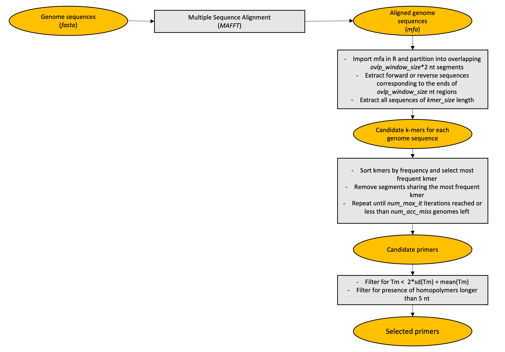

# nf-msspe
A NextFlow pipeline for Metagenomic Sequencing with Spiked Primer Enrichment

## Getting started

**Prerequisites**

* [Nextflow](https://nf-co.re/usage/installation)
* [Docker](https://docs.docker.com/engine/install/) or [Singularity](https://sylabs.io/guides/3.0/user-guide/installation.html)                                                                                                                  

**Installation**

```
git clone https://github.com/MaestSi/nf-msspe.git
cd nf-msspe
chmod 755 *
```

## Overview

<p align="center">
  
</p>

## Usage

The nf-msspe pipeline requires you to open nf-msspe.conf configuration file and set the desired options. Then, you can run the pipeline using either docker or singularity environments just specifying a value for the -profile variable.

```
Usage:
nextflow -c nf-msspe.conf run nf-msspe.nf --fasta_file = "/path/to/file.fasta" --primers_file = "/path/to/primers.fasta" -profile docker

Mandatory argument:
-profile                                                              Configuration profile to use. Available: docker, singularity
Other mandatory arguments which may be specified in the nf-msspe.conf file
--fasta_file = "/path/to/file.fasta"                                  Path to fasta file with genomes of interest
--primers_file = "/path/to/primers.fasta"                             Path to output fasta file with primers
--ovlp_window_size = 250                                              Size of windows overlaps
--search_window_size = 50                                             Search window size at the extremities of windows
--kmer_size = 13                                                      Primers length
--num_acc_miss = 0                                                    Number of accepted missed sequences, to reduce costs
--num_max_it = 1000                                                   Maximum number of iterations
--scripts_dir = "/path/to/scripts/dir"                                Path to directory containing MSSPE.R script
```

## Citation

This pipeline is a NextFlow implementation of MSSPE pipeline described in [Deng et al. paper](https://www.nature.com/articles/s41564-019-0637-9), with minor adjustments.

Deng, X., Achari, A., Federman, S. et al. Metagenomic sequencing with spiked primer enrichment for viral diagnostics and genomic surveillance. Nat Microbiol 5, 443–454 (2020).
